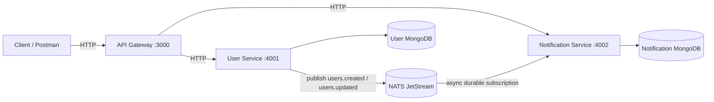

# Microservices Assignment — User + Notification + API Gateway

[](https://github.com/prince53454/microservices-nats-assignment/actions/workflows/ci.yml)

A production-style microservices backend built with **Node.js (JavaScript only)**, **Express**, **NATS JetStream**, **MongoDB/Mongoose** and **Docker Compose**.

- **API Gateway** — the single public entrypoint (`http://localhost:3000`): routing, JWT verification, rate limiting, request logging, Swagger docs.
- **User Service** — registration, login, profile; publishes `user.created` / `user.updated` events to JetStream.
- **Notification Service** — consumes user events from JetStream (durable consumer, explicit ACKs, idempotent handling, dead-lettering) and stores per-user notifications.

**Key constraint honoured by design:** the User Service and Notification Service **never communicate over REST or WebSockets** — their only channel is NATS JetStream events.

---

## 1. Project overview

This project demonstrates an event-driven microservices system. A client registers through the gateway, the User Service persists the user and publishes a `user.created` event, and the Notification Service consumes that event asynchronously to create a welcome notification the user can later read through the gateway.

## 2. Architecture



> **User Service ↔ Notification Service communication is exclusively asynchronous NATS events.** Neither service knows the other's address, and neither exposes an endpoint the other calls. The gateway talks HTTP to both; the services talk events to each other.

## 3. Technology stack

| Concern | Choice | Why |
|---|---|---|
| Runtime | Node.js 20, plain JavaScript | Requirement; async/await everywhere |
| HTTP | Express | Requirement; small, well-known |
| Messaging | NATS 2.10 + JetStream | Requirement; durable streams, at-least-once delivery, dedup |
| Persistence | MongoDB 7 + Mongoose | Requirement; two independent datastores (one per service) |
| Auth | JWT (`jsonwebtoken`) + `bcryptjs` | Requirement; stateless auth shared via `JWT_SECRET` |
| Validation | Joi (shared + per-service schemas) | Requirement; startup env validation too |
| Logging | pino (structured, redacting) | Requirement; JSON logs with requestId/eventId |
| Security | helmet, cors, rate-limiter-flexible | Requirement |
| Docs | swagger-ui-express + OpenAPI + Postman collection | Requirement |
| Tests | Jest + Supertest | Requirement |
| Packaging | Docker + Docker Compose | Requirement |

## 4. Why NATS JetStream (not core NATS, not Kafka)

- **Durability**: core NATS is at-most-once fire-and-forget; JetStream persists messages on disk and redelivers until acknowledged — required so a notification is never silently lost.
- **Explicit ACKs + redelivery**: a consumer that crashes mid-processing gets the message again (`ack_wait`, `max_deliver`).
- **Durable pull consumers**: the consumer's offset survives service restarts, and a *pull* consumer lets multiple replicas share the work safely (no duplicate fan-out).
- **De-duplication**: `Nats-Msg-Id` gives a server-side dedup window on publish.
- **Right-sized**: Kafka/RabbitMQ would add operational weight this assignment does not need; a single NATS binary with JetStream enabled covers the requirements.

## 5. Service responsibilities

| Service | Owns | Does |
|---|---|---|
| api-gateway | public contract | routing, JWT check, rate limiting, logging, docs, proxying with timeouts |
| user-service | users DB, JWT issuing, `users.*` events | register/login/profile, bcrypt hashing, event publishing |
| notification-service | notifications DB, processed-event ledger | consume events, validate, dedupe, create notifications, serve them |

Each service has its **own MongoDB database** — no shared storage.

## 6. Event flow

```
POST /api/auth/register
      -> gateway -> user-service
           -> save user (MongoDB)
           -> publish users.created  {eventId, eventType, eventVersion, timestamp, data}
                -> JetStream USER_EVENTS stream
                     -> notification-service durable consumer
                          -> validate envelope + payload
                          -> eventId already processed? -> ACK & ignore
                          -> create WELCOME notification
                          -> record eventId in ledger
                          -> ACK
```

Event envelope (published by user-service):

```json
{
  "eventId": "uuid-v4",
  "eventType": "user.created",
  "eventVersion": 1,
  "timestamp": "2026-09-08T12:00:00.000Z",
  "data": { "userId": "...", "name": "Vishwajeet", "email": "vish@example.com" }
}
```

Subjects: `users.created`, `users.updated`, dead-letter: `events.deadletter`.

## 7. Authentication flow

1. `POST /api/auth/register` or `/api/auth/login` returns `{ user, token }`.
2. The client sends `Authorization: Bearer <token>` afterwards.
3. The **gateway** verifies the JWT (signature + expiry) and forwards verified claims as `x-user-id` / `x-user-email` headers **plus the original token**.
4. Backend services **verify the token again** — they never trust gateway headers alone. Notification ownership is enforced by filtering Mongo queries on the token's `sub`.

## 8. Security decisions

- bcrypt (10 rounds) password hashing; hashes never leave the model (`toJSON` strips them).
- JWT secret from env, validated at startup (min length 32).
- helmet security headers; CORS allow-list; 100 kB JSON body cap.
- Rate limiting on all `/api` routes (user-id keyed when authenticated, IP otherwise).
- Login responses are identical for unknown-email and wrong-password (no account enumeration).
- Central error handler masks 5xx details; stack traces never reach clients.
- pino redacts `authorization` headers, passwords and tokens from logs.
- NATS requires credentials and is not published to the host; Mongo instances are internal-only.

## 9. Reliability strategy

- **JetStream stream** `USER_EVENTS` (file storage, 7-day age, 100k msgs) survives broker restarts (persistent Docker volume).
- **Durable pull consumer** `notification-service-user-events`: offset survives restarts; multiple replicas share one consumer — each message goes to exactly one replica.
- **Explicit ACKs**: ACK only after the notification *and* the ledger row are persisted.
- **Retries**: failures `nak()` with a 2 s delay; JetStream redelivers up to `MAX_DELIVERIES` (default 5).
- **Dead letter**: after the final failed delivery the message is `term()`-ed and copied to `events.deadletter` for inspection.
- **Publish acks**: `js.publish()` awaits a server PubAck; failures are logged (an outbox table is the production-grade next step).
- **HTTP resilience**: gateway proxies use 10 s timeouts and translate upstream failures into clean `503` envelopes — no infinite retries.

## 10. Idempotency strategy

At-least-once delivery means duplicates **will** happen (redelivery, restarts, retries). Defences:

1. **Consumer-side ledger**: a `processedevents` collection with a unique `eventId` index. Before handling, check the ledger; after handling, insert. A duplicate insert (race with another replica) is treated as success.
2. **Broker-side dedup**: publishes carry `msgID = eventId`, so JetStream drops re-published duplicates within the dedup window.
3. Result: replaying the same `user.created` event any number of times produces exactly one welcome notification.

## 11. Failure handling

| Failure | Behaviour |
|---|---|
| Mongo down during event handling | handler throws → `nak` → redelivery → eventually dead-letter |
| Duplicate event delivered | ledger hit → ACK, no duplicate notification |
| Malformed / invalid event | `term()` + dead-letter (never succeeds, don't retry) |
| Unknown event type | logged, ACKed, skipped (forward-compatible) |
| NATS connection loss | client reconnects automatically; durable consumer resumes where it left off |
| Backend service down | gateway returns `503 UPSTREAM_UNAVAILABLE` envelope |
| Bad JWT | `401` at gateway and again at service (defence in depth) |

## 12. Folder structure

```
microservices-nats-assignment/
├── api-gateway/
│   ├── src/
│   │   ├── config/        # env validation, logger
│   │   ├── docs/          # OpenAPI spec
│   │   ├── lib/           # vendored constants/errors/responses (self-contained serverless deploys)
│   │   ├── middleware/    # auth, rate limiter, request logger
│   │   ├── routes/        # public route table + proxies
│   │   ├── services/      # proxy factory
│   │   └── server.js
│   ├── test/
│   ├── Dockerfile
│   ├── package.json
│   └── .env.example
├── user-service/
│   ├── src/
│   │   ├── config/        # env, logger, jetstream
│   │   ├── controllers/
│   │   ├── events/        # JetStream publisher
│   │   ├── middleware/    # auth, validate
│   │   ├── models/
│   │   ├── routes/
│   │   ├── services/      # business logic + repository
│   │   ├── validators/
│   │   └── server.js
│   ├── test/
│   ├── Dockerfile
│   ├── package.json
│   └── .env.example
├── notification-service/
│   ├── src/
│   │   ├── config/
│   │   ├── controllers/
│   │   ├── events/        # durable consumer + handlers
│   │   ├── middleware/
│   │   ├── models/        # notifications + processed-event ledger
│   │   ├── routes/
│   │   ├── services/
│   │   ├── validators/
│   │   └── server.js
│   ├── test/
│   ├── Dockerfile
│   ├── package.json
│   └── .env.example
├── shared/                # constants, event schemas, ApiError, helpers
├── nats/nats.conf         # JetStream + auth config
├── docker-compose.yml
├── architecture.md
├── postman_collection.json
└── README.md
```

## 13. Environment variables

Every service validates its env at startup and refuses to boot with missing/invalid values.

| Variable | Service(s) | Purpose |
|---|---|---|
| `PORT` | all | listen port (3000 / 4001 / 4002) |
| `JWT_SECRET` | all | shared signing secret, min 32 chars |
| `MONGO_URI` | user, notification | per-service Mongo connection string |
| `NATS_URL` | user, notification | e.g. `nats://nats:4222` (docker) or `nats://localhost:4222` (local) |
| `NATS_USER` / `NATS_PASSWORD` | user, notification | broker credentials (from `nats.conf`) |
| `USER_SERVICE_URL` / `NOTIFICATION_SERVICE_URL` | gateway | internal upstream URLs |
| `RATE_LIMIT_WINDOW_MS` / `RATE_LIMIT_MAX` | gateway | rate-limit window and allowance |
| `MAX_DELIVERIES` | notification | JetStream `max_deliver` before dead-letter |
| `LOG_LEVEL` | all | pino level |
| `NATS_PASSWORD`, `JWT_SECRET`, `GATEWAY_PORT` | root `.env` | consumed by docker-compose |

## 14. Docker setup

`docker-compose.yml` builds all three services from the repo root context (so the `shared/` package is copied in), runs two Mongo instances and NATS with JetStream, and **publishes only the gateway port**. Services and databases talk over the internal compose network; Mongo data and JetStream data live in named volumes.

NATS is configured via `nats/nats.conf`: JetStream enabled, file storage in `/data`, single `appuser` account with credentials injected from the root `.env`.

## 15. Run locally

### With Docker (recommended)

```bash
git clone <repository>
cd microservices-nats-assignment

# 1. Root env: secrets consumed by docker-compose (NATS auth, JWT, gateway port)
cp .env.example .env

# 2. Per-service env files: used when running services directly on the host
#    (Docker containers take their config from compose `environment:` blocks)
cp api-gateway/.env.example api-gateway/.env
cp user-service/.env.example user-service/.env
cp notification-service/.env.example notification-service/.env

# 3. Edit .env: set JWT_SECRET and NATS_PASSWORD to strong values

docker compose up --build
```

The public URL is **http://localhost:3000**. Swagger UI: http://localhost:3000/api/docs

### Without Docker (per service)

```bash
# terminal 1: NATS (with JetStream) and MongoDB running locally
nats-server -c nats/nats.conf   # adjust NATS_PASSWORD first
mongod --dbpath /tmp/mongo-user &  mongod --port 27018 --dbpath /tmp/mongo-notif &

cd user-service && cp .env.example .env && npm install && npm start
cd notification-service && cp .env.example .env && npm install && npm start
cd api-gateway && cp .env.example .env && npm install && npm start
```

### No Docker and no NATS? Single-command local demo

If you have MongoDB on `127.0.0.1:27017` but neither Docker nor a `nats-server`
binary, `scripts/run-local-demo.js` boots the entire stack in one process. A
require-hook (`scripts/nats-shim.js`) routes each service's `require('nats')`
to `scripts/nats-emulator-server.js` — a tiny local broker implementing the
exact JetStream surface the services use (streams, durable consumers, explicit
acks, nak-redelivery, term, dead-letter, publish dedup via msgID). The event
flow is the real service code end to end; only the wire protocol is emulated.

```bash
mongod --dbpath ~/mongod-demo-data &      # local MongoDB
node scripts/run-local-demo.js            # boots :4222 :4001 :4002 :3000

# then:
#   Swagger UI  -> http://localhost:3000/api/docs
#   register    -> curl -X POST http://localhost:3000/api/auth/register \
#                    -H 'Content-Type: application/json' \
#                    -d '{"name":"Vishwajeet","email":"a@b.com","password":"supersecret1"}'
#   wait ~2s, then GET /api/notifications with the returned JWT
```

Do NOT point production code at the emulator — it is a demo scaffold, not a
protocol implementation. With Docker, the real `nats:2.10` server runs instead
and no shim is involved.

## 16. API documentation

Interactive: **http://localhost:3000/api/docs** · Machine: **/api/docs.json** · Postman: `postman_collection.json`

| Method | Endpoint | Auth | Body | Success | Errors |
|---|---|---|---|---|---|
| POST | `/api/auth/register` | — | `{name, email, password}` | 201 `{user, token}` | 400, 409, 429 |
| POST | `/api/auth/login` | — | `{email, password}` | 200 `{user, token}` | 400, 401, 429 |
| GET | `/api/users/me` | Bearer JWT | — | 200 `{user}` | 401 |
| PATCH | `/api/users/me` | Bearer JWT | `{name?, email?}` | 200 `{user}` | 400, 401, 409 |
| GET | `/api/notifications` | Bearer JWT | `?page&limit` | 200 `{notifications, pagination}` | 401 |
| GET | `/api/notifications/:id` | Bearer JWT | — | 200 `{notification}` | 401, 404 |
| GET | `/health` | — | — | 200 | — |

Error envelope: `{ "success": false, "error": { "code": "VALIDATION_ERROR", "message": "..." } }`

## 17. Example requests

```bash
# 1. Register (returns a JWT)
curl -s -X POST http://localhost:3000/api/auth/register \
  -H 'Content-Type: application/json' \
  -d '{"name":"Vishwajeet","email":"vish@example.com","password":"supersecret1"}'

# 2. Use the token
TOKEN=eyJhbGciOi...

# 3. Give the async pipeline a moment, then read notifications
sleep 2
curl -s http://localhost:3000/api/notifications -H "Authorization: Bearer $TOKEN"

# -> { "success": true, "data": { "notifications": [
#      { "type": "WELCOME",
#        "message": "Welcome Vishwajeet! Your account has been successfully created.",
#        ... } ] } }
```

## 18. Testing instructions

```bash
cd user-service && npm install && npm test
cd notification-service && npm install && npm test
cd api-gateway && npm install && npm test
```

Covered: registration validation, login success/failure, JWT gating, duplicate email (409), notification ownership (404 for other users' rows), event envelope/payload validation, duplicate-event idempotency (ACK, no second notification), retry/dead-letter behaviour, gateway rate limiting and upstream-failure envelopes. In production you would add: mongodb-memory-server based repository tests, a testcontainers NATS instance for true end-to-end event flow, and contract tests for the gateway proxies.

## 19. Scalability discussion

- **Notification Service**: the durable *pull* consumer is the scale-out mechanism — run N replicas against the same durable name and JetStream hands each message to exactly one replica (work-queue semantics). The idempotency ledger also covers rare cross-replica races. Scale: `docker compose up --scale notification-service=3`.
- **User Service**: stateless HTTP — run N replicas behind the gateway (DNS round-robin, or a real LB in production). JWT means no session affinity is needed.
- **Gateway**: stateless; the in-memory rate limiter becomes per-instance — swap in `RateLimiterRedis` for a global limit.
- **NATS**: single-node here; production would run a 3-node JetStream cluster with raft-replicated streams.
- **MongoDB**: per-service databases scale independently; add replicasets/sharding per service as load demands.

## 20. Production improvements

- **Transactional outbox**: persist events in the same Mongo transaction as the user, with a relay publishing to NATS — removes the (currently logged) publish-failure gap.
- Replace the in-memory rate limiter with Redis; add distributed tracing (OpenTelemetry) and metrics (Prometheus).
- Message schema registry + versioned consumers (`eventVersion` is already in the envelope).
- Refresh tokens, account lockout, email verification flows.
- CI pipeline: lint (ESLint), tests, docker build, image scanning.
- Kubernetes manifests with liveness/readiness probes wired to `/health` and `/ready`.
- DLQ *consumer* with alerting, rather than only publishing to `events.deadletter`.

## 21. Deployment (Vercel gateway + Railway services)

The intended cloud topology is a **hybrid**: the stateless gateway runs as a
serverless function on **Vercel**, while the user/notification services and
NATS run as long-lived containers on **Railway**, with MongoDB on Atlas.
The notification service *cannot* be serverless — its durable JetStream
consumer must stay connected to receive events.

Full step-by-step instructions, environment variables, cost notes and
verification commands: **[DEPLOYMENT.md](DEPLOYMENT.md)**.

Key deployment settings:

- `INTERNAL_API_KEY` — shared secret; the gateway sends it as
  `x-internal-api-key` and backend services reject traffic without it
  (needed because services must have public URLs in the hybrid topology).
- `TRUST_PROXY=2` on Vercel so rate limiting keys on the real client IP.
- Same `JWT_SECRET` on gateway + user-service; same `NATS_PASSWORD` on both
  services and the NATS server.

### Push to GitHub

```bash
git init
git add .
git commit -m "Microservices assignment: gateway + user + notification services with NATS JetStream"
git branch -M main
git remote add origin https://github.com/prince53454/microservices-nats-assignment.git
git push -u origin main
```

`.env` files are git-ignored — only `.env.example` templates are committed.
CI (`.github/workflows/ci.yml`) then runs the three test suites on every push.
