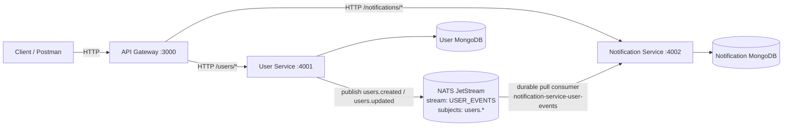
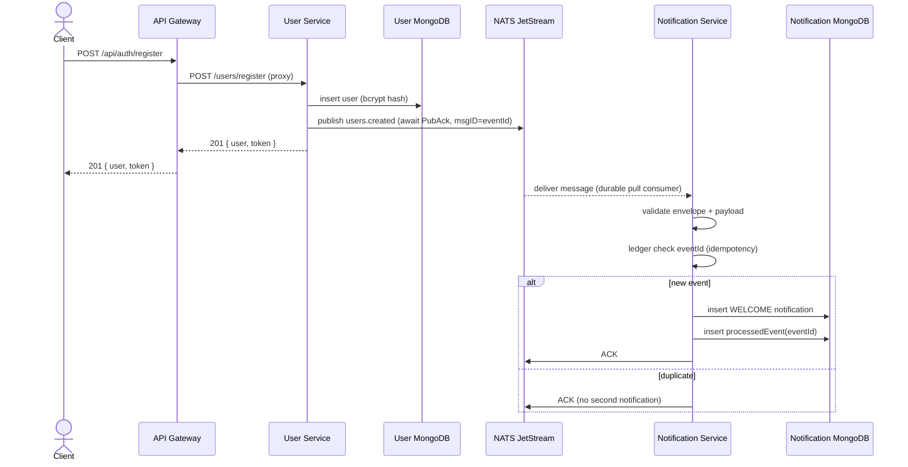
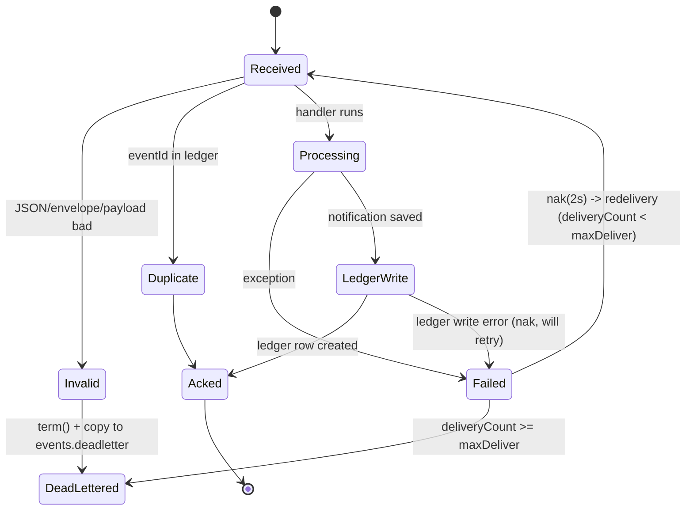

# Architecture

## Component overview

**Rule enforced throughout the codebase:** User Service and Notification Service never call each other over REST or WebSockets. The only channel between them is the JetStream stream. The gateway is the sole HTTP client of both services.

## Registration sequence

## Event processing state machine

## Data ownership

| Store | Owner | Contents |
|---|---|---|
| `users` DB | User Service | users (name, email, bcrypt hash, isActive, timestamps) |
| `notifications` DB | Notification Service | notifications (userId, type, message, status) + processedevents ledger |
| JetStream `USER_EVENTS` | shared bus | user lifecycle events, file-backed, 7-day retention |

No service reads another service's database. Cross-service data flows only through events.

## Ports and exposure

| Component | Port | Exposure |
|---|---|---|
| API Gateway | 3000 | published to host (only public port) |
| User Service | 4001 | internal network only |
| Notification Service | 4002 | internal network only |
| NATS client | 4222 | internal network only (auth required) |
| NATS monitoring | 8222 | internal network only |
| MongoDB ×2 | 27017 | internal network only |
